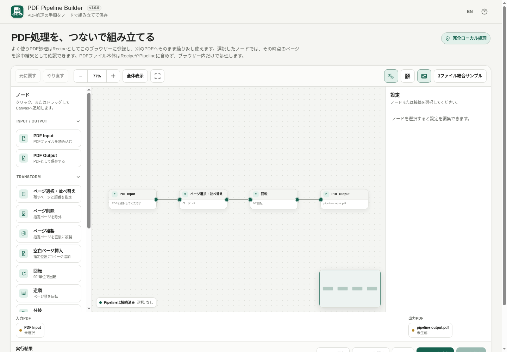

# PDF Pipeline Builder

[](https://github.com/ttomohisa/htmlapps-pdf-pipeline-builder/actions/workflows/deploy-pages.yml)
[](LICENSE)
[](https://ttomohisa.github.io/htmlapps-pdf-pipeline-builder/)

[日本語版 README](README.ja.md)

A privacy-focused, single-HTML web app for building reusable PDF-processing workflows as node Pipelines. Connect page operations visually, inspect intermediate results, save frequently used flows as browser-local Recipes, and generate PDFs without uploading selected files to a server.

## 🚀 Live demo

### [Open PDF Pipeline Builder on GitHub Pages](https://ttomohisa.github.io/htmlapps-pdf-pipeline-builder/)

GitHub Pages delivers the initial HTML. After it loads, selected PDFs, intermediate previews, Recipe execution, and generated output are processed locally on your device. The PDFs you select are not uploaded by the app.

[](https://ttomohisa.github.io/htmlapps-pdf-pipeline-builder/)

## Features

- **Build PDF processing as a visual Pipeline** — Connect Input, page operations, document processing, branching, Merge, and Output nodes in the order you want them to run.
- **Preview before the final run** — Select a node to inspect the PDF state at that point. PDF Output is shown as the final Result, and previews can be enlarged.
- **Reuse saved Recipes quickly** — Save a Pipeline as a browser-local Recipe, attach new PDFs above the editor, then either apply it to the Canvas for editing or generate an output preview without replacing the current Canvas.
- **Branch and combine page streams** — Split a stream into Selected / Rest and Merge 2–6 inputs in a defined order.
- **Add document finishing steps** — Insert page numbers, text watermarks, and preset text stamps at the exact point where they should affect the Pipeline.
- **Edit comfortably on desktop and mobile** — Click or drag nodes from the palette, collapse palette groups, use Undo / Redo, Pan / Zoom / Fit, MiniMap, helper lines, Grid snap, and the enlarged workspace.
- **Private, single-HTML operation** — `pdf-lib` and Node Editor Core are embedded, runtime network access is blocked, and source/generated PDF bytes are not stored in Pipeline JSON or Recipes.

## Quick start

### Use the web demo

Just [open the demo](https://ttomohisa.github.io/htmlapps-pdf-pipeline-builder/). No installation or account is required.

### Use the standalone HTML

1. Download a release package or clone this repository.
2. On Windows, run `build-standalone.bat`. It verifies the PowerShell scripts, downloads the pinned dependency archive when needed, and generates the standalone files.
3. Open the generated `dist/index.html` in a current Chromium-based browser.
4. Copy that single HTML file wherever you need it. After it has been generated, the app can run without a network connection.

The release builder uses Windows PowerShell and the built-in `tar.exe`; Node.js is not required for the release build or for using `dist/index.html`. Node.js is used only for the repository's developer-side test / fast local build helpers.

## Usage

1. Add one or more **PDF Input** nodes and choose local PDF files.
2. Add processing nodes by clicking the palette or dragging a node onto the Canvas.
3. Connect nodes in processing order. Use Split / Merge when you need branches.
4. Select any node to inspect its settings and local intermediate preview. Select **PDF Output** to inspect the final Result.
5. Connect the final page stream to **PDF Output**, set the output filename, then run the Pipeline and save the generated PDF.
6. Save the graph as Pipeline JSON when you want a portable backup, or register it as a Recipe when you want to reuse the same processing steps quickly in this browser.

### Quick Recipes

Saved Recipes appear above the node editor and start collapsed.

- Open a Recipe and choose or drop one PDF for each required PDF Input.
- **Apply to Canvas** asks for confirmation, then replaces the current Canvas with the Recipe and carries the staged PDFs into the editor.
- **Use this Recipe** leaves the current Canvas untouched, runs the Recipe separately, and opens a local output preview. The PDF is downloaded only after you press **Save PDF** in that preview.
- Recipe persistence stores the processing graph and settings, not source PDF bytes, generated PDF bytes, staged files, source filenames, or source page counts.

### Pipeline JSON

Pipeline JSON is intended for backup, transfer, or version control. Reopening a Pipeline restores nodes, edges, settings, positions, viewport, and output filename, but source PDFs must be selected again.

Opening Pipeline JSON over unsaved Canvas changes requires an in-app confirmation. Cancelling preserves the current graph and runtime PDF selections.

## Processing nodes

| Group | Nodes |
| --- | --- |
| Input / Output | PDF Input, PDF Output |
| Page operations | Select / Reorder, Delete Pages, Duplicate Pages, Insert Blank Page, Rotate, Reverse Pages |
| Branch / Combine | Split Pages, Merge Pages (2–6 inputs) |
| Document processing | Page Numbers, Watermark, Text Stamp |

Page expressions such as `all`, `1-3,5`, and `3,1,2` refer to the page stream that reaches that node. Graph order therefore matters. For example, `Reorder → Page Numbers` numbers the reordered sequence, while `Page Numbers → Reorder` moves the already-numbered pages.

## Preview and output behavior

Intermediate Preview evaluates only the upstream path needed by the selected node, so unrelated branches do not need to be loaded just to inspect another branch.

- Preview shows up to six pages at a time with Previous / Next navigation.
- Split Preview can switch between `Selected` and `Rest`.
- Each preview page can be enlarged.
- PDF Output uses the label **Result** instead of Intermediate Preview.
- Preview and output frames use temporary local Blob URLs; they do not load PDF data from external URLs.

Preview display uses the browser's built-in inline PDF viewer. Chrome and Edge are the primary targets.

## Publish with GitHub Pages

The repository includes a workflow that builds the standalone HTML, verifies the repository, and deploys `dist/` to GitHub Pages.

1. Push the repository to GitHub as `htmlapps-pdf-pipeline-builder`.
2. Open **Settings → Pages → Build and deployment → Source** and select **GitHub Actions**.
3. Push to `main`, or manually run **Deploy standalone app to GitHub Pages** from the Actions tab.
4. After a successful deployment, the demo is available at `https://ttomohisa.github.io/htmlapps-pdf-pipeline-builder/`.

The workflow also uploads `dist/index.html`, `dist/index.self-extract.html`, and the generated manifests as a build artifact.

## Development and build layout

```text
.
├─ src/index.template.html          # Application template
├─ src/vendor/node-editor-core.mjs # Node Editor Core 1.0.0
├─ src/vendor/pdf-lib.min.js        # Embedded pdf-lib runtime
├─ app.config.json                  # App metadata / build policy
├─ dependencies.json                # Dependency declaration
├─ dependencies.lock.json           # Pinned dependency lock + hashes
├─ build.mjs                        # Standalone / self-extract builder
├─ build-standalone.bat             # Windows build entry point
├─ tests/                           # Regression tests
├─ assets/                          # favicon and screenshots
└─ dist/                            # Generated release artifacts
```

Release build on Windows:

```bat
build-standalone.bat
```

For a fast developer-side local build, `node build.mjs` is also available. The GitHub Actions release path uses the PowerShell builder above.

Test:

```bash
npm test
```

For the full repository verification used by GitHub Actions, run on Windows / PowerShell:

```powershell
.\scripts\check-repository.ps1
```

See [VERIFY_OFFLINE.md](VERIFY_OFFLINE.md) for the release verification checklist.

## Privacy and runtime network protection

The generated HTML is designed for fully local PDF processing after the file has been loaded.

- Content Security Policy includes `connect-src 'none'`.
- Runtime `fetch`, `XMLHttpRequest`, and `WebSocket` are not used by the application.
- Intermediate / Result previews use only local Blob PDF URLs, allowed by `frame-src blob:`.
- Source PDF bytes stay in runtime memory and are not written into Pipeline JSON or Recipe storage.
- Recipes are stored in this browser's `localStorage`; if persistent storage is unavailable, the app falls back to session memory and shows a warning.
- The GitHub Pages version requires the initial HTML request, but selected PDF content is not transmitted by the app.

For use with the network completely disconnected, open the generated `dist/index.html` locally.

## Limitations

- Preview display depends on the browser's built-in inline PDF viewer; Chrome and Edge are the primary supported targets.
- Custom Watermark text is limited to ASCII characters because v1.0.0 uses the embedded standard PDF font and does not embed custom Japanese fonts.
- PDF editing can invalidate digital signatures.
- Bookmarks, attachments, forms, signatures, outlines, and other document-level structures are not guaranteed to be preserved when pages are rebuilt into a new output PDF.
- Large PDFs and complex multi-branch Pipelines can consume substantial device memory because processing is fully local.
- Recipe storage is browser-local. Use Pipeline JSON for backup, transfer, or Git-based storage.
- Source PDF bytes are intentionally not persisted, so PDF Inputs need re-selection after reopening Pipeline JSON or loading a stored Recipe for editing.

## Dependencies

| Library | Version | License | Purpose |
| --- | ---: | --- | --- |
| pdf-lib | 1.17.1 | MIT | Local PDF loading, page copying, transformation, document overlays, and output generation |
| Node Editor Core | 1.0.0 | Project source | Graph editing, ports/edges, selection, viewport, Undo / Redo, MiniMap, and serialization |

No dependency is loaded from a runtime CDN. See [THIRD_PARTY_NOTICES.md](THIRD_PARTY_NOTICES.md) for details.

## Contributing

Bug reports and feature proposals are welcome through GitHub Issues. See [CONTRIBUTING.md](CONTRIBUTING.md) for development guidance.

## License

Copyright © 2026 ttomohisa

Licensed under the [MIT License](LICENSE).
